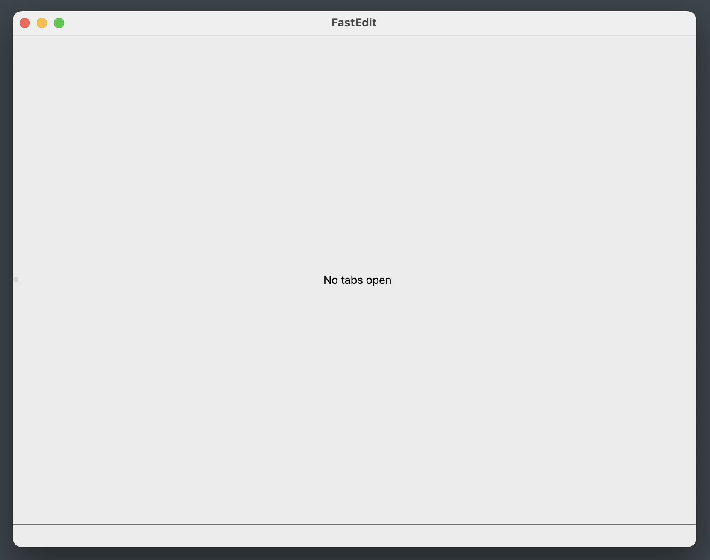
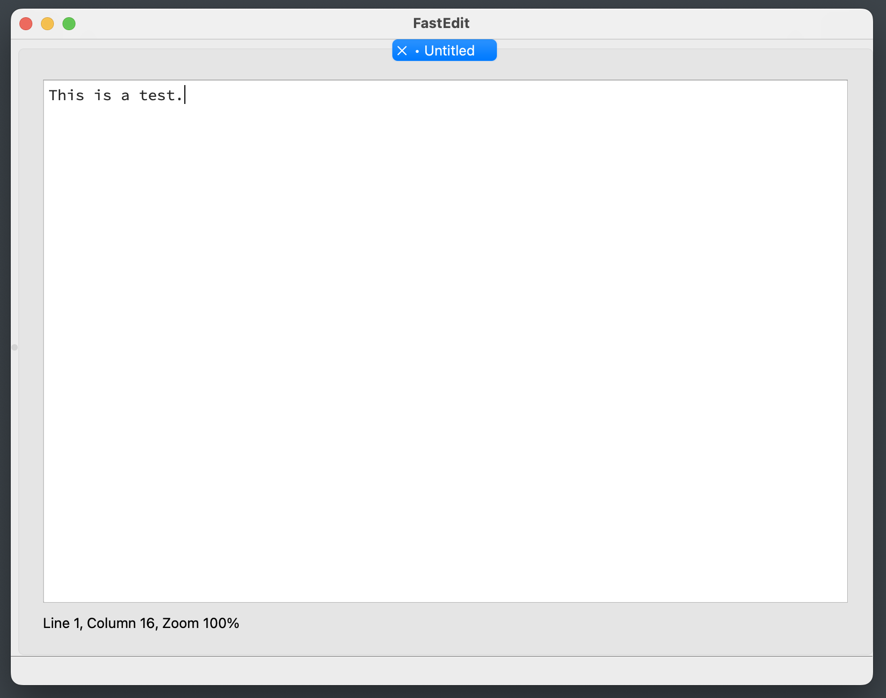
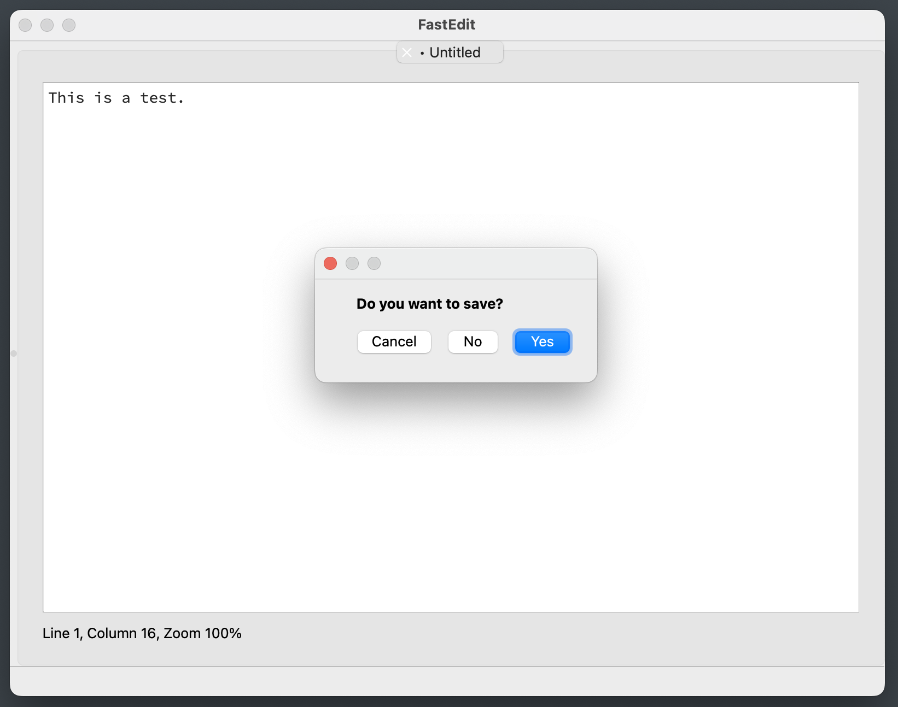
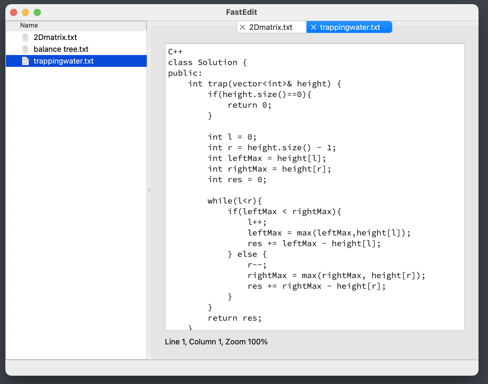
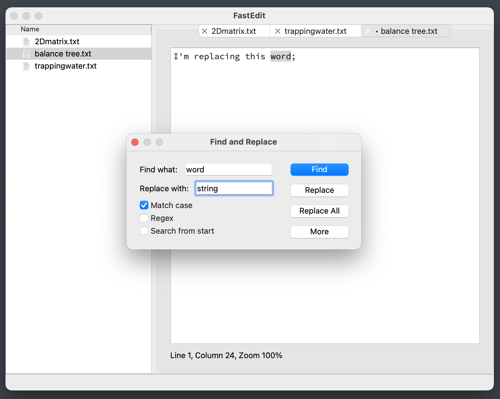
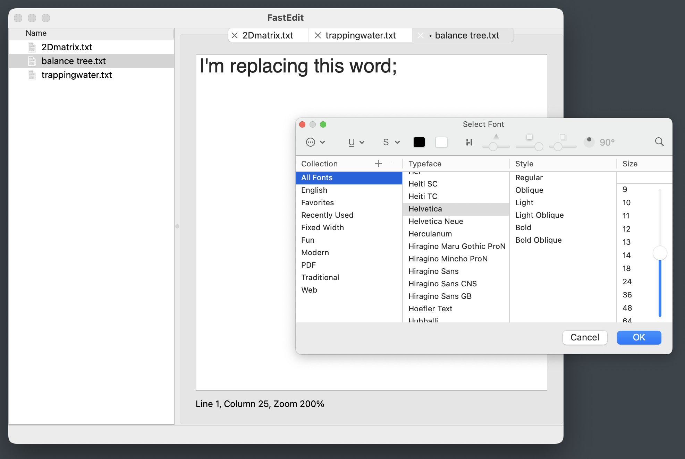

# FastEdit

FastEdit is a simple and intuitive notepad application. It provides a user-friendly interface and several powerful features to enhance your text editing experience.

## Features

### Main Window

When you open FastEdit, you'll see a window with the message "No tabs open" in the center.

#### Main Window (Windows)

#### Main Window (MacOS)

### Creating a New File

You can create a new empty file by using the shortcut `CTRL+N` (Windows) or `CMD+N` (MacOS) and start writing immediately.

#### New File (Windows)

#### New File (MacOS)

### Managing Tabs

Files open as tabs, and you can move the tabs around and close them using `CTRL+W` (Windows) or `CMD+W` (MacOS). If you've modified a file, a dot appears before the file name in the tab. If you attempt to close a modified file without saving, a save warning will prompt you to save the file before closing.

#### Save Warning (Windows)

#### Save Warning (MacOS)

### Opening Files and Folders

You can open a file with `CTRL+O` (Windows) or `CMD+O` (MacOS). Additionally, you can open a folder with `CTRL+ALT+O` (Windows) or `CMD+OPT+O` (MacOS). This will display a side view of the folder's contents, allowing you to open files by clicking their names.

#### Open Folder (Windows)

#### Open Folder (MacOS)

### Edit Functions

FastEdit includes all the usual edit functions such as copy, paste, cut, delete, undo, redo, and find and replace.

#### Find and Replace (Windows)

#### Find and Replace (MacOS)

### Format Menu

The Format menu allows you to change the font or return to the default format settings. By selecting "Change font," you can modify the font and size of the text in your current file.

#### Change Font (Windows)

#### Change Font (MacOS)

## Shortcuts

### File Menu
- **New File**: `CTRL+N`
- **Open File**: `CTRL+O`
- **Open Folder**: `CTRL+ALT+O`
- **Save**: `CTRL+S`
- **Save As**: `CTRL+SHIFT+S`
- **Close File**: `CTRL+W`
- **Close Folder**: `CTRL+ALT+W`

### Edit Menu
- **Undo**: `CTRL+Z`
- **Redo**: `CTRL+Y`
- **Cut**: `CTRL+X`
- **Copy**: `CTRL+C`
- **Paste**: `CTRL+V`
- **Delete**: `CTRL+BACKSPACE`
- **Find**: `CTRL+F`
- **Find Replace**: `CTRL+ALT+F`

### View Menu
- **Default Zoom**: `CTRL+0`
- **Zoom in**: `CTRL + =`
- **Zoom out**: `CTRL + -`

---

Feel free to contribute to the project or report any issues you encounter. Enjoy using FastEdit!
